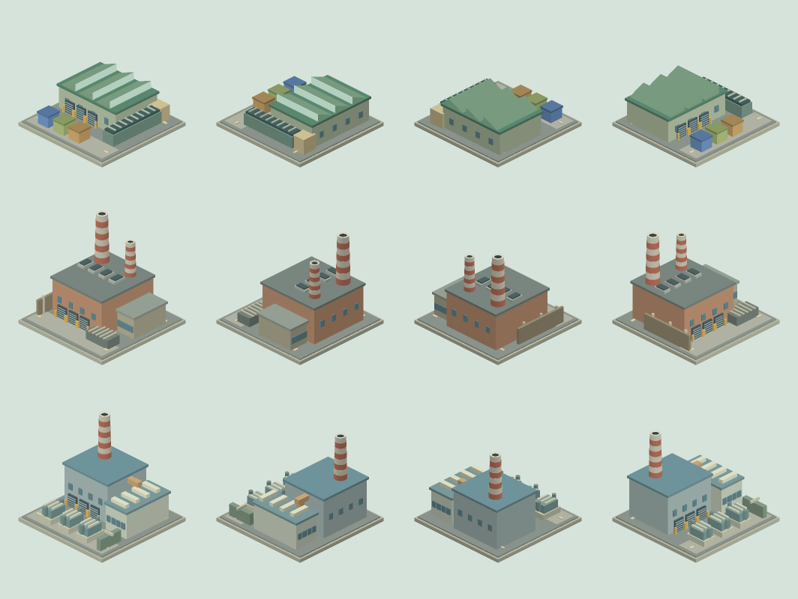

# Four-view waste facilities milestone

Recycling centers, incinerators and waste-to-energy plants now have distinct original 3D geometry rendered into transparent 2D city sprites for all four rotations. Recycling has a sawtooth sorting roof, conveyors and colored material bins; incineration has a brick furnace hall and paired stacks; waste-to-energy has a boiler hall, heat-recovery duct and electrical yard.

The original geometry extends the shared miniature rasterizer. Per-pixel depth resolves overlapping roofs, pipes and stacks. Twelve cached 512-pixel images use at most 12 MiB of pixel storage; city placement, visibility and layer fading follow the existing renderer. Artwork does not alter construction prices, footprints, pollution or waste-processing capacity. Save schema remains 119.

Rows: recycling, incinerator, waste-to-energy. Columns: rotations 0–3. Generate the contact sheet with `node scripts/render-waste-preview.mjs`.

## Operating smoke

Purpose: state indication for active waste processing, rather than a response to frequent UI actions. Existing Canvas world rendering is the appropriate tool for dynamic city-space effects. Smoke uses linear movement and opacity on an eight-second cycle, driven by the existing paused world clock. No motion library, separate timer or per-frame image rasterization is added.

Only incinerators and waste-to-energy plants with positive last-month throughput and current road access emit smoke. Fire, rubble, radiation or unusable roads suppress it. Recycling does not burn rubbish. Data maps hide plumes. Reduced motion and disabled scenery animation hold a static phase, while ordinary pause preserves the current phase. Emission density follows recorded throughput; this is visual state indication, not a new pollution simulation.

## Feedback and verification

Build all three facilities and rotate the city. Supply garbage to the burners, then pause and resume to check plume continuity. Compare small and large waste volumes; turn on reduced motion or disable scenery animation and confirm a still scene. Local browser inspection verified all three facilities and rotation after importing a paused QA city. It caught an incorrect city reference that interrupted rendering at the first burner; the fix is covered by a full CityRenderer regression in all four views. The original New Haven city was preserved in the named library and restored afterward. Extended motion-feel testing and player acceptance remain pending.

198 regression suites pass. New checks cover projected bounds, distinct views, bounded cache reuse, actual renderer placement/rotation/layer gating, smoke timing and throughput, reduced-motion/scenery gating, and unchanged construction/save/monthly outcomes. The twelve-view contact sheet has been visually inspected. GitHub source milestone only; Sites publication still awaits source-export approval.
